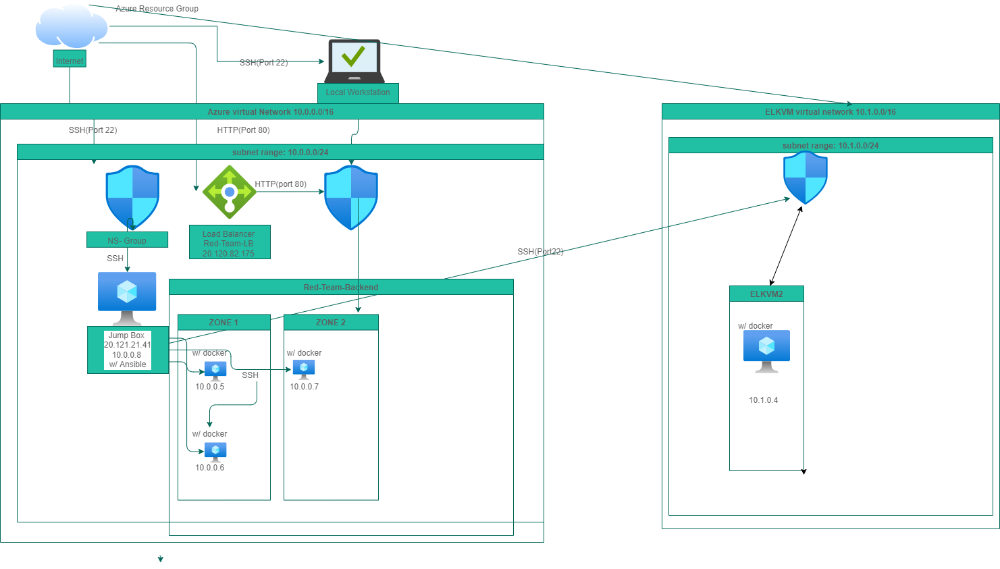

## Automated ELK Stack Deployment

The files in this repository were used to configure the network depicted below.

These files have been tested and used to generate a live ELK deployment on Azure. They can be used to either recreate the entire deployment pictured above. Alternatively, select portions of the _elk.yml__ file may be used to install only certain pieces of it, such as Filebeat.

  : Enter the playbook file etc/ansible/elk.yml.

This document contains the following details:
- Description of the Topology
- Access Policies
- ELK Configuration
  - Beats in Use
  - Machines Being Monitored
- How to Use the Ansible Build

### Description of the Topology

The main purpose of this network is to expose a load-balanced and monitored instance of DVWA, the D*mn Vulnerable Web Application.

Load balancing ensures that the application will be highly available, in addition to restricting access to the network.
: What aspect of security do load balancers protect? Determines, figures, and load manages traffic across machines. What is the advantage of a jump box?_

Integrating an ELK server allows users to easily monitor the vulnerable VMs for changes to the logs and system metrics.
: What does Filebeat watch for?Filebeat monitors the log files or locations that you specify, collects log events, and forwards them either to Elasticsearch or Logstash for indexing.
: What does Metricbeat record?Metricbeat records the metrics and statistics that it collects and ships them to the output that you specify, such as Elasticsearch or Logstash.

The configuration details of each machine may be found below.
_Note: Use the [Markdown Table Generator](http://www.tablesgenerator.com/markdown_tables) to add/remove values from the table_.

| Name     | Function | IP Address | Operating System |
|----------|----------|------------|------------------|
| Jump Box | Gateway  | 10.0.0.8   | Linux            |
| web-1    | Webserver| 10.0.0.5   | Linux            |
| web-2    | Webserver| 10.0.0.6   | Linux            |
| Elk      |Elk Server| 10.1.0.4   | Linux            |

### Access Policies

The machines on the internal network are not exposed to the public Internet. 

Only the Jumpbox machine can accept connections from the Internet. Access to this machine is only allowed from the following IP addresses:
home network ip

Machines within the network can only be accessed by home network ip.
: Which machine did you allow to access your ELK VM? Jumpbox. What was its IP address? 20.120.21.41

A summary of the access policies in place can be found in the table below.

| Name     | Publicly Accessible | Allowed IP Addresses |
|----------|---------------------|----------------------|
| Jump Box | No                  | 10.0.0.8             |
| web-1    | No                  | 10.0.0.8             |
| web-2    | No                  | 10.0.0.8             |
| ELKVM    | No                  | 10.0.0.8             |
### Elk Configuration

Ansible was used to automate configuration of the ELK machine. No configuration was performed manually, which is advantageous because the use of ansible allows you to work more efficiently by reducing redundant task through automation, still while improving the overall system.
 What is the main advantage of automating configuration with Ansible?

The playbook implements the following tasks:
- _TODO: In 3-5 bullets, explain the steps of the ELK installation play. E.g., install Docker; download image; etc._
 configure web-1,web-2
-Install ELK server 
-Install Filebeat 
-Install Metricbeat

The following screenshot displays the result of running `docker ps` after successfully configuring the ELK instance.

### Target Machines & Beats
This ELK server is configured to monitor the following machines:
10.0.0.5, 10.0.0.6

We have installed the following Beats on these machines:
Filebeat 
Metricbeat

These Beats allow us to collect the following information from each machine:
Filebeat is a delivery tool for forwarding and centralizing log data. Filebeat monitors log files or locations you specify, gathers the log events, and then forwards to the elastic search or Logstash for indexing. 
Metricbeat consists of modules and metricsets. A Metricbeat module defines the basic logic for collecting data from a specific service, such as Redis, MySQL, and so on. 
### Using the Playbook
In order to use the playbook, you will need to have an Ansible control node already configured. Assuming you have such a control node provisioned: 

SSH into the control node and follow the steps below:
- Copy the etc/ansible file to ???
- Update the host file to include webserver's IP and ELKserver IP
- Run the playbook, and navigate to _HTTP://{elk's IP}:5601 to check that the installation worked as expected.

_TODO: Answer the following questions to fill in the blanks:_
- _Which file is the playbook? elk.yml Where do you copy it? etc/ansible/
- _Which file do you update to make Ansible run the playbook on a specific machine?ansible-playbook elk.yml How do I specify which machine to install the ELK server on versus which to install Filebeat on?_
- _Which URL do you navigate to in order to check that the ELK server is running?

_As a **Bonus**, provide the specific commands the user will need to run to download the playbook, update the files, etc._